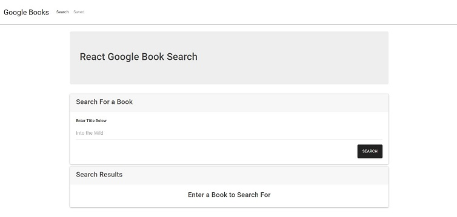

<h1 align=center>React Google Book Search</h1>

- Link to GitHub repository: https://github.com/Tzcodes101/googleBooks
- Link to deployed site: https://calm-springs-50745.herokuapp.com/
- Link to video walkthrough: https://drive.google.com/file/d/1YNu2PtJPWSrZApQDmA5DvIhBPWgd5C-e/view

## Description
This project is a React-based Google Books Search app. It was created using React components, util functions, and React lifecycle methods to query and display books based on user searches. Use of Node, Express, and MongoDB enable a user to save and view books for later purchase. 

## Table of Contents
- [Description](#Description)
- [Installation](#Installation)
- [Usage](#Usage)
- [License](#License)
- [FutureDevelopment](#FutureDevelopment)
- [Contributors](#Contributors)
- [Testing](#Testing)
- [Questions](#Questions)

## Installation
This project requires no installation.

## Usage
To use this project, a user must navigate to the deployed URL. 

## License

This project is covered by the ISC license.

## Future Development
This project has a clean UI, but could use some futher styling to make it truly eye-catching and appealing. 

## Contributors
- Talia Zisman

## Testing
This project can be tested by following the usage instructions.

## Questions
Please e-mail the creator, Talia Zisman, of this application with any questions.
- E-mail: tzcodes101@gmail.com
- GitHub: [tzcodes101](http://github.com/tzcodes101)